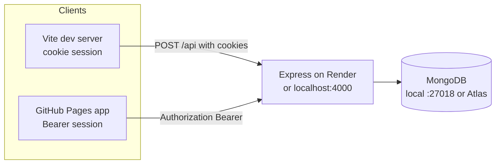
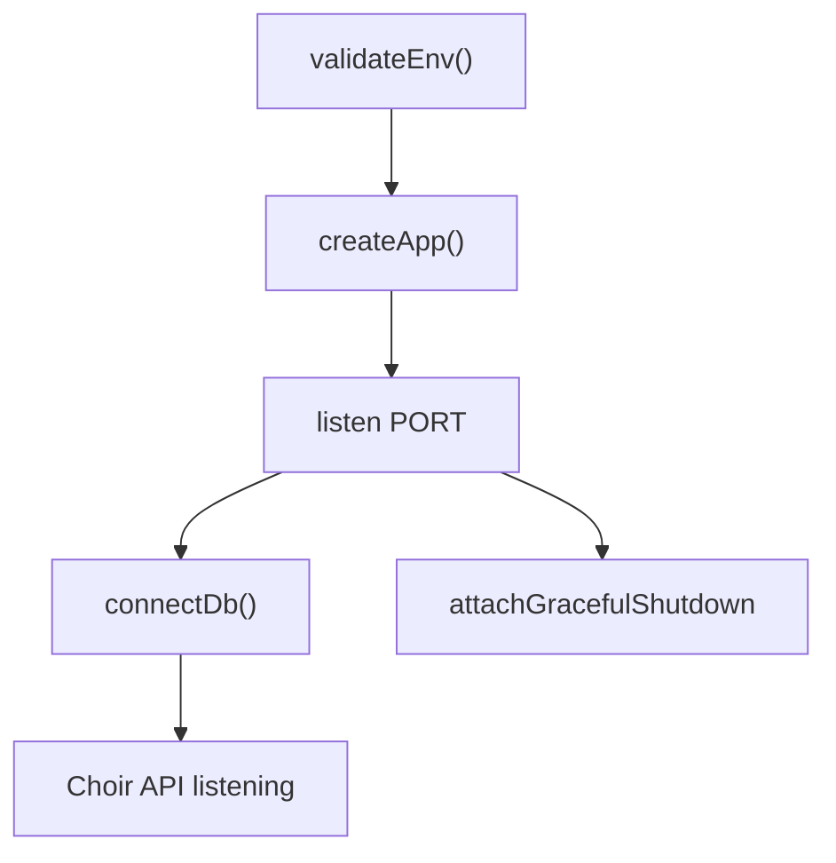
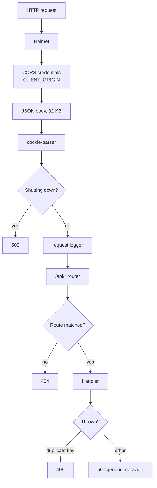
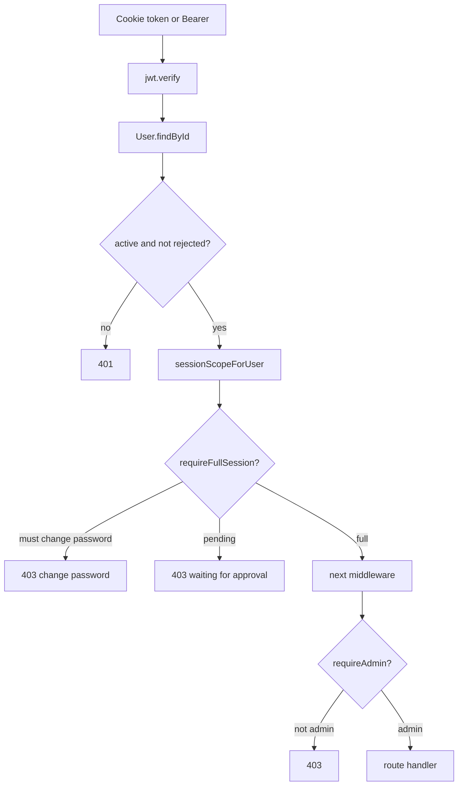
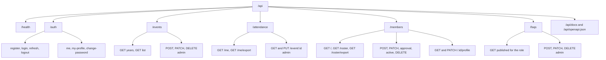
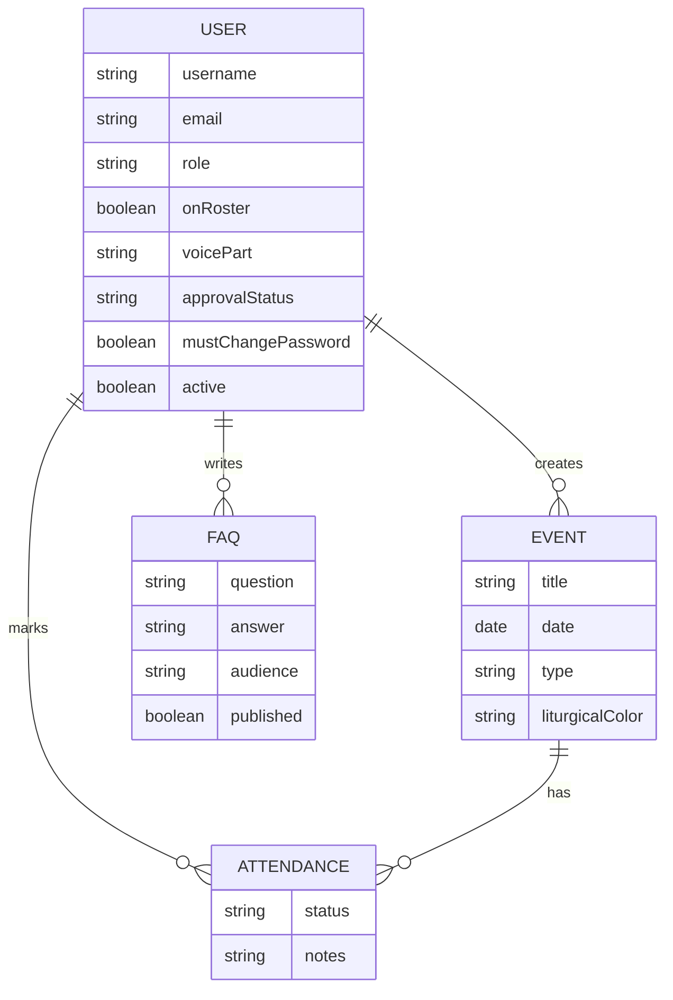
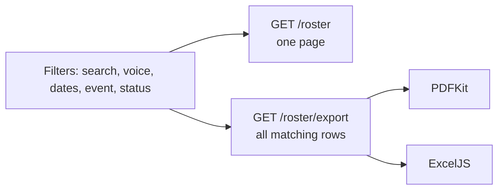
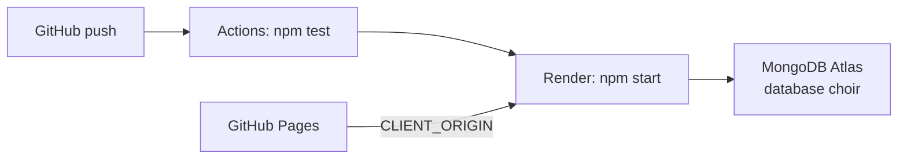

# Architecture

How the choir API starts, how a request is authorized, and how the data is stored. Setup and the route catalogue are in the [README](../README.md). Journeys that cross several routes are in [end-to-end.md](end-to-end.md).

## System

`createApp()` in `src/app.js` builds the Express app used by both `src/index.js` and the tests. Tests never open a port or a database.

## Boot

`validateEnv()` refuses to start when `MONGODB_URI` or `JWT_SECRET` is missing. In production it also requires `CLIENT_ORIGIN` and a JWT secret of at least 32 characters, and it rejects a short list of placeholder secrets.

## Request pipeline

Health checks are logged less aggressively than other routes. Audit events record the action name, user id, and username. Passwords and tokens are not written to the log.

## Authorization

| Scope | Who | What they can call |
| --- | --- | --- |
| `must-change-password` | `mustChangePassword` is true | Auth routes. Admins can also call `/api/members` |
| `pending` | Singer not yet approved | Auth routes |
| `full` | Approved singer or admin who has set a password | Events, attendance, FAQs, and profile reads |

Events, attendance, and FAQs mount `requireAuth`, `requireFullSession`, and `requireApproved` for the whole router. Member routes mount `requireAuth` and `requireAdmin` only.

Access tokens last 15 minutes. Refresh tokens last 7 days, are stored as a SHA-256 hash, and rotate on every refresh. Production cookies are `SameSite=None; Secure` so the Pages origin can send them. Local cookies are `SameSite=Lax`.

Auth routes are limited to 30 requests per 15 minutes per IP.

## Route map

## Data

`Attendance` has a unique index on `(user, event)`.

`onRoster` matters for admins. A member is always on the singing roster. An admin is on it only when `onRoster` is true. Take-attendance and the roster query use that rule. Demoting the last admin is rejected.

Profile history (voice range, choir pathway, feedback text) is stored on the user document. Each update appends an entry with who recorded it and when. Singers read their own history from `GET /api/auth/my-profile`. Admins read and update a singer through `/api/members/:id/profile`.

## Roster and export

`GET /api/attendance/me/export` uses the same filter rules as `GET /api/attendance/me`, then builds a PDF or workbook for that singer. `format` is `pdf` or `xlsx`. The response is the file, with `Content-Disposition` exposed so the browser can read the filename.

## Deploy

Render sets `PORT`. The service needs `NODE_ENV=production`, `MONGODB_URI`, `JWT_SECRET`, and `CLIENT_ORIGIN`. Seed the admin once against that URI. The client build needs `VITE_API_URL` pointing at the Render origin.
