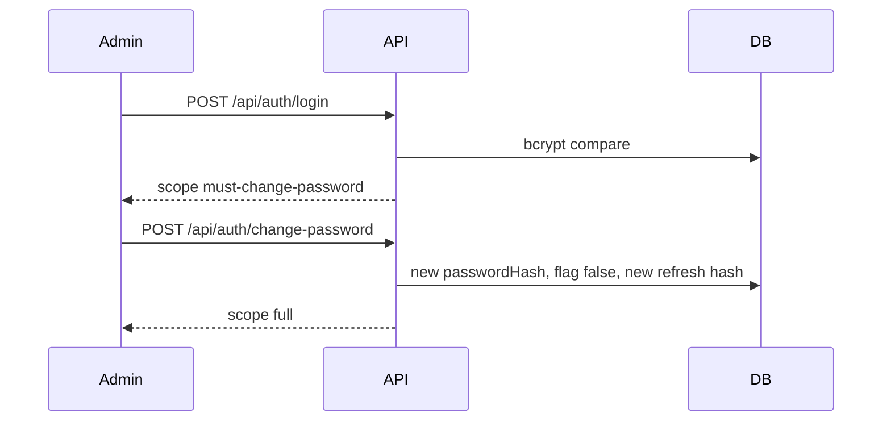
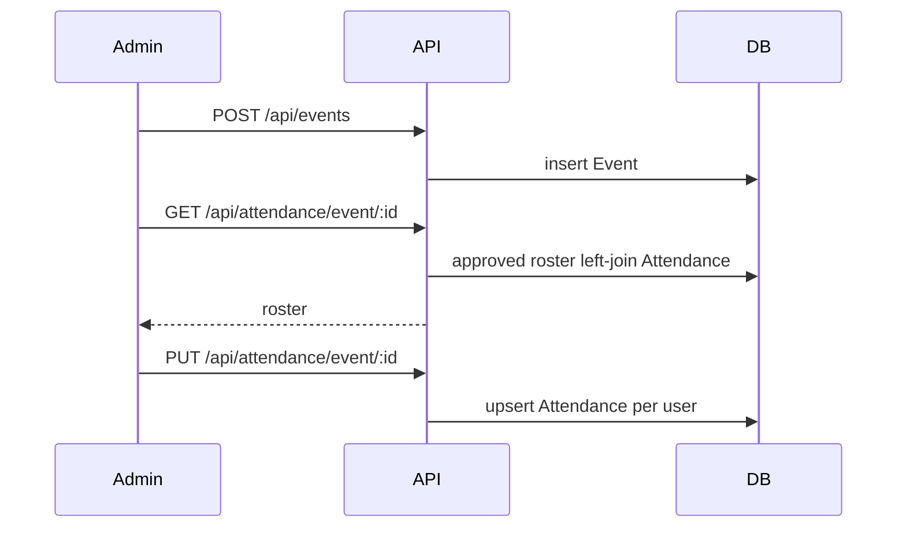

# End-to-end flows

These are the journeys the API is built for, as a sequence of HTTP calls. Screen names are the web app. Field rules and example bodies are in the [README](../README.md).

Local cookies are enough for every call below. Send `X-Auth-Client: bearer` when you want `token` and `refreshToken` in the JSON body, which is what the GitHub Pages app does.

## 1. First admin login

The seed script creates `admin` with `mustChangePassword: true`.

| Step | Call | Result |
| --- | --- | --- |
| 1 | `POST /api/auth/login` | 200, scope `must-change-password` |
| 2 | `GET /api/events` | 403, password change required |
| 3 | `GET /api/members` | 200 for this admin, because member routes do not use `requireFullSession` |
| 4 | `POST /api/auth/change-password` | 200, scope `full`, flag cleared |
| 5 | `GET /api/events` | 200 |



`GET /api/auth/me` re-issues the session when the token scope is behind the user document, for example after this password change or after an approval.

## 2. Self-registration and approval

| Step | Who | Call | Result |
| --- | --- | --- | --- |
| 1 | Singer | `POST /api/auth/register` | 201, `approvalStatus: pending`, role `member` |
| 2 | Singer | `GET /api/attendance/me` | 403, waiting for approval |
| 3 | Admin | `GET /api/members` | `pending` array includes the singer |
| 4 | Admin | `PATCH /api/members/:id/approval` with `approved` | 200 |
| 5 | Singer | `GET /api/auth/me` | scope `full` |
| 6 | Singer | `GET /api/attendance/me` | 200 |

`rejected` removes them from the pending list. A rejected account cannot sign in. Setting `pending` again puts them back in the queue.

Register and login are rate limited. Duplicate username and duplicate email return 409 with different messages.

## 3. Create an event and save attendance

| Step | Call | Result |
| --- | --- | --- |
| 1 | `POST /api/events` | 201, admin only |
| 2 | `GET /api/attendance/event/:eventId` | Roster of active approved singers, plus admins with `onRoster: true` |
| 3 | `PUT /api/attendance/event/:eventId` | One record per user. Status is `present`, `absent`, `late`, or `excused` |

Unmarked people are sent by the app as absent at save time. The GET leaves them as `status: ""` when no attendance document exists yet.

Deleting an event deletes its attendance rows.



The attendance rate stored for display is calculated when the roster is read:

```
round((present + late) / (present + absent + late) × 100)
```

Excused rows are returned in the counts and left out of that denominator.

## 4. Roster, filters, and export

`GET /api/members/roster` is paginated (`page`, `limit`, max 100). Filters:

| Query | Effect |
| --- | --- |
| `search` | Name, username, or email |
| `voicePart` | One voice |
| `from`, `to` | Stats use events in that range |
| `eventId` | Stats and status are for that event; `from` and `to` are ignored |
| `attendanceStatus` | Keep singers whose mark matches |

`GET /api/members/roster/export?format=pdf|xlsx` repeats those filters with `all: true` and returns a file. The client also sends `fields` for the columns it wants. The `Content-Disposition` filename looks like `st-pauls-choir-roster-YYYY-MM-DD.pdf`.

## 5. Account administration

All of these require an admin.

| Action | Call | Effect |
| --- | --- | --- |
| Add singer | `POST /api/members` | Approved member. Optional password |
| Edit account | `PATCH /api/members/:id` | Name, username, email, voice, role, `onRoster`. A new `password` sets `mustChangePassword` |
| Approve or decline | `PATCH /api/members/:id/approval` | `approved`, `rejected`, or `pending` |
| Deactivate | `PATCH /api/members/:id/active` | `active: false` blocks sign-in and hides them from take-attendance. History remains |
| Delete | `DELETE /api/members/:id` | User and their attendance rows are removed |

`GET /api/members` returns three lists: `pending`, `inactive`, and `declined`. Admins are edited through `PATCH /api/members/:id` as well. The last admin cannot be changed to `member`.

Giving someone `role: admin` can set `onRoster`. `false` means they manage the choir and do not appear in take-attendance. `true` means they still sing. Omitting `onRoster` keeps the current value, so promoting a singer leaves them on the roster.

## 6. Feedback profile

| Who | Call | Body |
| --- | --- | --- |
| Admin | `GET /api/members/:id/profile` | Singer id, name, voice, and history |
| Admin | `PATCH /api/members/:id/profile` | Any of `voiceRange` (max 200), `feedback` (max 2000), `choirPathway` |
| Singer | `GET /api/auth/my-profile` | Own history. Members only |

Pathways: `lead-vocalists`, `emerging-vocalists`, `vocal-strengthening`, `vocal-development`, `explore-other-service`.

Each accepted value is appended to that history with `recordedAt` and the admin's name. Empty strings are rejected.

## 7. A singer's own history

`GET /api/attendance/me` accepts the event filters (`search`, `type`, `liturgicalColor`, `year`, `from`, `to`, `eventId`) plus `status` (`present`, `absent`, `late`, `excused`, `upcoming`, `unmarked`) and `page` / `limit`.

When `eventId` is set, the date range is ignored. When a status or a single event is selected, the summary is built from the history rows so an unmarked past event counts as absent in that view.

`GET /api/attendance/me/export?format=pdf|xlsx` uses the same filters and returns `st-pauls-my-attendance-YYYY-MM-DD.pdf` or `.xlsx`. Columns the client may request: date, event, type, color, status, notes.

## 8. FAQs

| Call | Who | Result |
| --- | --- | --- |
| `GET /api/faqs` | Approved singer or admin | Published items for that role (`member`+`both`, or `admin`+`both`) |
| `GET /api/faqs?manage=true` | Admin | Every FAQ, including unpublished |
| `POST /api/faqs` | Admin | Question max 300, answer max 5000, audience `member`, `admin`, or `both` |
| `PATCH /api/faqs/:id` | Admin | Same fields, plus `published` and `sortOrder` |
| `DELETE /api/faqs/:id` | Admin | Removes the FAQ |

Answers are plain text. The web app does not render them as HTML.

## 9. Session end

| Call | Result |
| --- | --- |
| `POST /api/auth/refresh` | New access token and a rotated refresh token. The previous refresh hash no longer works |
| `POST /api/auth/logout` | Refresh hash cleared, cookies cleared, `{ "ok": true }` |
| Any call with a bad access token | 401 `Session expired. Please sign in again.` |

On process shutdown, new requests receive 503 once the shutdown flag is wired. In-flight requests are given `SHUTDOWN_TIMEOUT_MS` (default 10 seconds) to finish, then MongoDB disconnects.
